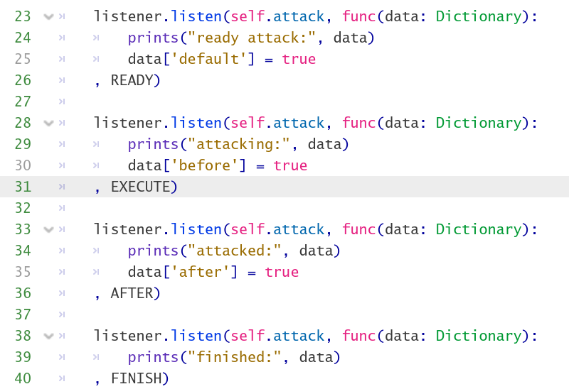
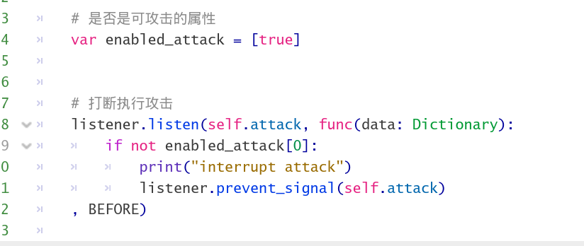
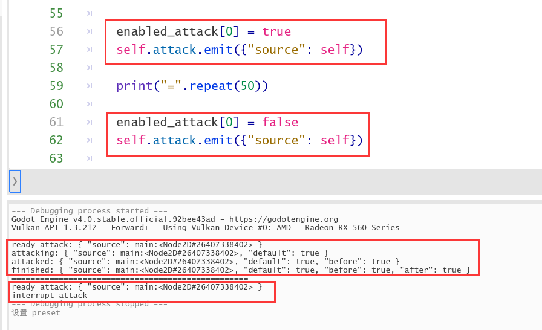

### Signal Listener

---

Give signals priority and make them scalable at will. 

让信号具有优先级，信号变得像脚本一样具有扩展性

Execute interrupt signals according to different timing

根据不同的时机进行中断信号的执行

For example

比如示例代码

Interrupt the execution of subsequent methods  

打断后续方法的执行

